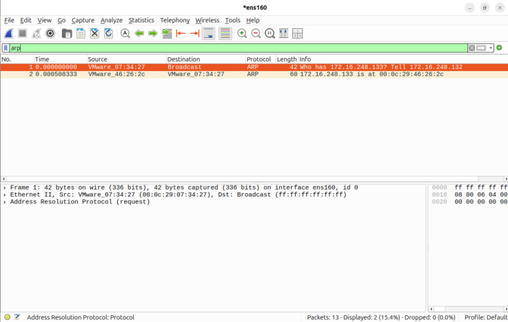
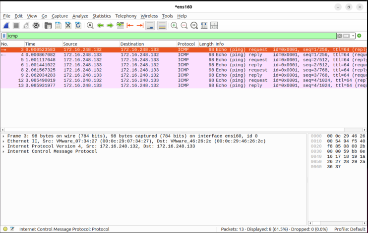
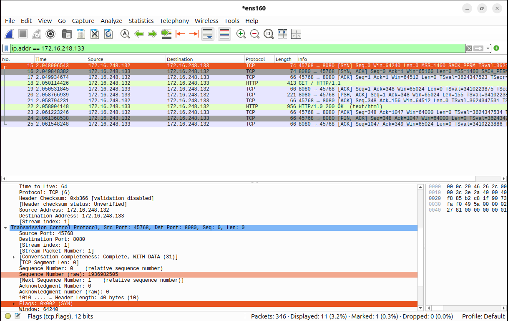
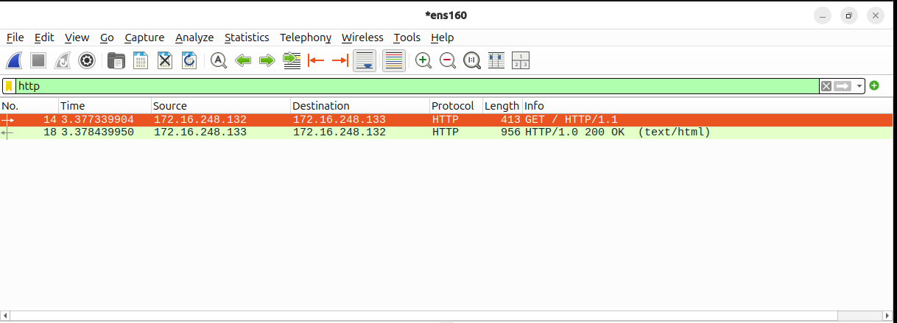

# OSI-Model-Wireshark-Lab
A security-focused packet analysis lab demonstrating how normal network communication behaves across OSI layers using Wireshark.

## 🛡️ Project Overview

This lab demonstrates how network traffic flows across OSI layers through hands-on packet capture analysis. 
Using two Ubuntu virtual machines, I analyzed ARP resolution, ICMP reachability, TCP handshakes, and HTTP traffic 
to understand how security analysts observe normal network behavior before detecting anomalies.

## Lab Enviorment

- VMware Fusion
- Ubuntu Client & Server
- NAT Network
- Wireshark
- Python HTTP Server

## OSI Layer Analysis

### Layer 2 – ARP
Observed MAC resolution through broadcast ARP requests and replies.

### Layer 3 – ICMP
Verified network reachability using echo request and reply.

### Layer 4 – TCP
Captured SYN, SYN-ACK, ACK handshake.

### Layer 7 – HTTP
Analyzed GET requests from Python HTTP server.

## What I Learned

- How devices establish identity using MAC addresses
- How ICMP verifies connectivity
- How TCP establishes reliable sessions
- How application traffic depends on lower OSI layers

---

## 🛡️ Security Perspective
From a security perspective, this project helped me understand the importance of establishing a baseline of normal network behavior. By recognizing how ARP, ICMP, TCP, and HTTP traffic normally appear in Wireshark, I can better identify abnormal patterns that may indicate issues such as ARP spoofing, unauthorized scanning, or suspicious network impersonation.

Instead of only learning theory, visually observing the packet flow strengthened my understanding of how analysts investigate traffic and validate communication between systems. This project also helped me think more critically about how layered communication works and why security monitoring requires visibility across multiple protocols.

---

## 🧠 Reflection & Future Improvements
I wanted to fully understand how data flows through the network, and what better way to do that then visually see how it happens. So I created two VM's (Virtual Machines) using VMwarefusion for Mac and connected them together through NAT network which served as the physical foundation (layer 1). After setting the enviorment I opened wireshark and used the teriminal to ping the server-side VM. With this it captured the ARP request and reply showing MAC address resolution before communication begins (Layer 2). This helped me understand how devices establish identity within a local network. Next Wiresharks captured ICMP echo request and reply verifying reachability between client and server (Layer 3).
 
I then generated HTTP traffic using a Python web server, I was able to observe the TCP three-way handshake (SYN,SYN-ACK,ACK), which establishes a reliable session between devices(Layer 4)seeing this helped me understand how structured communication is negotiated before any application data is transfered. Finally, I captured HTTP GET requests, which shows me how application-layer traffic relies on the underlying OSI layer to function(Layer 7). This project helped me move from simply learning networking concepts to thinking more like a security analyst, focusing on how normal traffic patterns can be used as a baseline for detecting anomalies.

